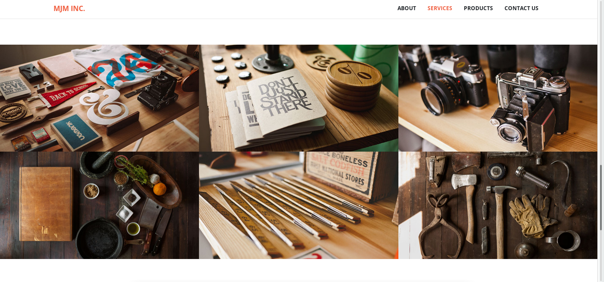
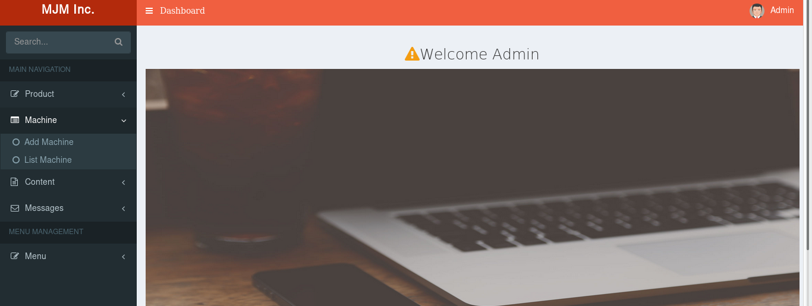

## Myprojects
---
Hello, my name is heriipurnama and this is a list of some projects I have ever developed and do in a project either in PT.Solusi 247 company or doing personal research.

###### 1. BUSINESS INTELLIGENCE
More or less for four months I work in smart business, in this smart business I play a role in two projects:

###### A. Dashboard Warroom
Here I played a report using software from Tibco that is Spotfire. The data in this report using the oracle Databases then created a report using Spotfire. This project is included in the project from Telkomsel DSI [Direct Sales Marketing].

###### B. Digimon [Digital Monitoring]
On this project move or migrate the old app, which previously used HTML 5 was moved to Tibco Spotfire. Databases used still use Oracle Databases. This project is also included in the Telkomsel project.

###### 2. DEVELOP WEB APPLICATION
###### A. APEX - Tsel Point
On web development projects I have been involved in the manufacture of CR or called Customer Request in TSEL POINT Project or Telkomsel Point where using APEX on its development. Here it only plays a role to continue the existing application and do the development when the client wants to add new features in this application. Language used more to PL / SQL.
###### B. PACS [Picture Archiving and Communication System]
Hospital application development project with DICOM used for hospital. This project enters the project backend which merely integrates Orthanct, Solr and the web interface.

###### C. KKP SIDATIK [Sistem Informasi Data Dan Statistik]
In this web application is involved in the addition of features.[visit](http://sidatik.kkp.go.id/).
This application is built using CI framework php and GeoServer.
###### D. MJM
This project is a project profile company built using PHP native Db MySQL. Here plays a backend frontend.

User

Admin

###### E. LMS [Loyalty Management System]
Migrate app from APEX to Javascript. This project is more moving PL / SQL Query to JavaScript and then displayed with ReactJS.
in this project plays fullstack developer, Create API and Web Display.
Tool tools used Loopback API, ReactJS, OracleDb etc.
